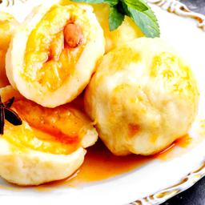

# Food Classification

for [KT challenge](https://genielabs.ai/support/notice/noticeDtl?boardSeq=1186)

not pretrained

```shell
food-kt
├── data
│     ├── train
│     │     ├── 간자장
│     │     │     ├── xxxxxx.jpg
│     │     │     ├── ...
│     │     │     └── yyyyyy.jpg
│     │     ├── ...
│     │     └── 후랑크소시지
│     ├── val
│     └── test
├── code
│     ├── datasets.py
│     ├── get_confusion_matrix.py
│     ├── inference.py
│     ├── models.py
│     ├── sweep.py
│     ├── sweep.yaml
│     ├── train.py
│     └── utils.py
├── ckpt
├── submissions (산출물)
├── wandb
├── requirements.txt
├── README.md
├── train.sh    (final train script)
└── test.sh     (final test script)
```

# Usage

## 1. (option) docker 설정 및 접속 후 ssh 연결

```shell
docker-compose up -d
docker attach food-kt
passwd
service ssh start
```

## 2. (option) wandb api key 등록 및 확인

```shell
export WANDB_API_KEY=YOUR_API_KEY
echo $WANDB_API_KEY
```

## 3. (option) wandb sweep을 이용한 하이퍼 파라미터 자동 탐색 (AutoML)

```shell
wandb sweep sweep.yaml
wandb agent <USERNAME/PROJECTNAME/SWEEPID>
```

## 4. 학습

```shell
python code/train.py
```

#### Arguments

| option            | type   | 설명                                | default               |
|-------------------|--------|-----------------------------------|-----------------------|
| --data_dir        | str    | 이미지 루트 디렉토리                       | /home/work/team01/food-kt/data               |
| --save_dir        | str    | 체크포인트 저장 경로                       | /home/work/team01/food-kt/ckpt               |
| --model           | str    | 사용 모델명                            | tf_efficientnet_b4_ns |
| --img_size        | int    | 이미지 크기                            | 384                   |
| --seed            | int    | seed                              | 42                    |
| --aug_ver         | int    | 데이터 증식 버전                         | 0                     |
| --epochs          | int    | 학습 에폭                             | 100                   |
| --batch_size      | int    | 배치 사이즈                            | 32                    |
| --num_workers     | int    | worker 개수                         | 4                     |
| --loss            | str    | loss 함수                           | smoothing_ce          |
| --label_smoothing | float  | label_smoothing                   | 0.5                   |
| --optimizer       | str    | 옵티마이저                             | adamw                 |
| --learning_rate   | float  | learning rate                     | 1e-3                  |
| --weight_decay    | float  | weight decay                      | 0.05                  |
| --cutmix          | bool   | CutMix 적용 여부                      | True                  |
| --mix_prob        | float  | CutMix 적용 확률                      | 0.5                   |
| --cutmix_stop     | int    | CutMix 중지할 에폭                     | 51                    |
| --wandb           | bool   | WandB 사용 여부                       | True                  |
| --amp             | bool   | Automatic Mixed Precision 적용 여부   | True                  |

## 5. 인퍼런스

### 테스트 파일에 레이블에 제공되는 경우

```shell
food-kt
├── data
│     ├── train
│     ├── val
│     └── test
│           ├── 간자장
│           │     ├── xxxxxx.jpg
│           │     ├── ...
│           │     └── yyyyyy.jpg
│           ├── ...
│           └── 후랑크소시지
```

```shell
python code/inference.py --mode 'with_label' --test_data_dir '/home/work/team01/food-kt/data/test'
```
#### Result (print)
```shell
============================================

final accuracy: 91.55%

============================================
```

### 테스트 파일에 레이블에 제공되지 않는 경우

```shell
food-kt
├── data
│     ├── train
│     ├── val
│     └── test
│           ├── xxxxxx.jpg
│           ├── ...
│           └── yyyyyy.jpg
```

```shell
python code/inference.py --mode 'no_label' --test_data_dir '/home/work/team01/food-kt/data/test'
```
#### Result (csv)
```shell
image_name,label
02_021_02011001_160527375090022_0_1.jpg,간자장
02_021_02011001_160610771451751_1_1.jpg,간자장
...
```

#### Arguments

| option          | type  | 설명                                 | default               |
|-----------------|-------|------------------------------------|-----------------------|
| --data_dir      | str   | 이미지 루트 디렉토리                       | /home/work/team01/food-kt/data               |
| --test_data_dir | str   | 테스트 이미지 디렉토리                    | /home/work/team01/food-kt/data/test          |
| --ckpt          | str   | 체크포인트 저장 경로                        | /home/work/team01/food-kt/ckpt/tf_efficientnet_b4_ns_0927_062809/ckpt_best.pt               |
| --model         | str   | 사용 모델명                             | tf_efficientnet_b4_ns |
| --img_size      | int   | 이미지 크기                             | 384                   |
| --seed          | int   | seed                               | 42                    |
| --aug_ver       | int   | 데이터 증식 버전                          | 5                     |
| --batch_size    | int   | 배치 사이즈                             | 32                    |
| --num_workers   | int   | worker 개수                          | 4                     |
| --amp           | bool  | Automatic Mixed Precision 적용 여부    | True                  |
| --mode          | str   | 인퍼런스 모드 ['no_label', 'with_label'] | 'no_label'            |
| --save_dir      | str   | 산출물 파일 저장 경로                | /home/work/team01/food-kt/submissions        |
| --csv_name      | str   | submission csv 파일 이름               | 'test                 |

### Visualing Results
| Original Image | Gradcam Cam Image of Classfier Head | Guided Backpropagation Image of Classfier Head |
| ---------------------------------------------------------------|--------------------|-----------------------------------------------------------------------------|
  |  |  |